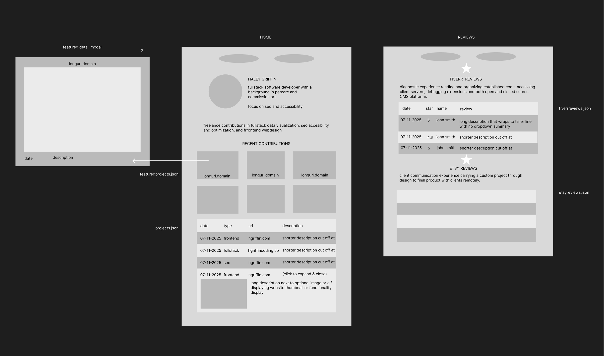

# <www.hgriffincode.com>

Server side rendering json to html data visualization of recent contributions and reviews with node js server and express js templating

## links

<https://github.com/h-griffin>
<https://www.fiverr.com/griffincode>
<https://www.fiverr.com/griffincode#:~:text=137-,Reviews,-4.9>
<https://www.etsy.com/shop/odetocharcoal>
<https://www.etsy.com/shop/odetocharcoal?dd_referrer=#reviews>
<https://griffinspetcare.com/>

## Buildflow
- figma whiteboard block planning

- object to table entity relationship diagram


## TO DO

- Figma
- order history projects.md
- Reviews  reviews.md
  - Etsy 5s 26 <https://www.etsy.com/shop/odetocharcoal?dd_referrer=#reviews>
    - virtual comunication
    - client expectations
  - Fiverr 4.9s 137 <https://www.fiverr.com/griffincode#:~:text=137-,Reviews,-4.9>
- Node js .ejs
  - SSR json to html
- Featured (6?)
  - fullstack data visualization
  - frontend web design
  - seo accessibility and optimization
- Recent contributions
  - table, summmary details
  - img in dropdown?
- Domain
- Firebase
- Optimize
  - srcset mobile
  - Server convert png to webp?
  - readme Pagespeed score
- Git delete ds store
  - feature based commit

## format

```js

const express = require('express');
const app = express();
const fs = require('fs');

// app.js (Server)

app.set('view engine', 'ejs');

app.get('/', (req, res) => {
    const reviewData = { //json file
        "date":"07-21-2022",
        "stars":5,
        "name":"cheeto",
        "desc":"cool review"
    }
    const projectData = { //json file
        "url":"michiganpsychologicalcare",
        "domain":".com",
        "date":"07-21-2022",
        "type":"frontend",
        "display": true,
        "live": true,
        "desc":"convert word doc to html and update php blog pages and pagination. upload php to server with filezilla FTPS"
    }
    // Read and parse the JSON file
    const jsonData = JSON.parse(fs.readFileSync('./data.json', 'utf8'));
    
    // Render the EJS template and pass the data object
    res.render('index', { project: projectData, review: reviewData });
    // res.render('index', { data: jsonData });
});

app.listen(3000);

```

```html
 
<table>
    <tr>
        <th>date</th>
        <th>type</th>
        <th>url</th>
        <th>description</th>
    </tr>

    <% projects.forEach(function(project) { %>
        <% if (project.display) { %>
            <tr>
                <td><%= project.date %></td>
                <td><%= project.type %></td>
                <% if (project.live) { %>
                    <td><a href="https://<%= project.url %><%= project.domain %>">www.<%= project.url %><%= project.domain %></a> </td> 
                <% } else { %>
                    <td><%= project.url %></td> 
                <% }
                <td>
                    <details>
                        <summary>desc...</summary>
                        .png" alt="<%= project.url %>">
                        <p><%= project.desc %></p> 
                    </details>
                </td>
            </tr>
        <% }
    <% }); %>

</table> 

<style>
/* summary */
.truncate {
  white-space: nowrap;     /* Prevents the text from wrapping to a second line */
  overflow: hidden;        /* Hides any text that extends beyond the container width */
  text-overflow: ellipsis; /* Adds "..." at the point where the text is cut off */
  width: 250px;            /* Container must have a defined width or max-width */
}
</style>
```

```html

<table>
    <tr>
        <th>date</th>
        <th>stars</th>
        <th>name</th>
        <th>desc</th>
    </tr>

    <% reviews.forEach(function(review) { %>
        <tr>
            <td><%= review.date %></td>
            <td><%= review.stars %></td>
            <td><%= review.name %></td>
            <td><%= review.desc %></td>
        </tr>
    <% }); %>

</table> 
```
